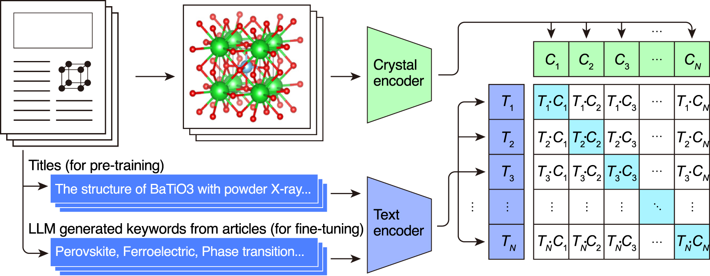

# CLaSP

## Overview
CLaSP (Contrastive Language-Structure Pre-training) is a multimodal learning framework that bridges crystal structures and text descriptions from scientific literature. 

This repository contains the official implementation of the paper "Bridging text and crystal structures: literature-driven contrastive learning for materials science" ([Y. Suzuki, T. Taniai, R. Igarashi _et al_ 2025 _Mach. Learn.: Sci. Technol._ __6__ 035006](https://iopscience.iop.org/article/10.1088/2632-2153/ade58c)).

CLaSP enables:
- Text-based retrieval of crystal structures
- Zero-shot classification of materials based on their properties
- Serving as a foundation model for multimodal tasks bridging crystal structures and text (similar to CLIP)

<p align="center">
  
</p>
<p align="center">Contrastive learning paradigm of CLaSP in two stages. (1) Pre-training using pairs of crystal structures and publication titles. (2) Fine-tuning using pairs of crystal structures and keywords that are generated from the titles and abstracts using an LLM. (image from our paper).</p>

## Installation

### Using Docker (Recommended)
```bash
# Build Docker image from repository root
docker build -t clasp:v1.0 -f docker/Dockerfile .
```

### Requirements for manual setup
- Python 3.8+
- PyTorch 2.2+
- CUDA 12.1+ (for GPU support)
- See `docker/Dockerfile` for complete dependencies


## Pre-trained Models & Data (Release v1.0.0)

We release both the model checkpoint and the keyword caption dataset used in our experiments.  
ℹ️ For full details, see the [v1.0.0 release notes](https://github.com/Toyota/clasp/releases/tag/v1.0.0).

| Asset | Description | Download |
|---|---|---|
| model checkpoint | Checkpoint fine-tuned with COD structures and text captions | [model_finetuned_s30_m05.ckpt](https://github.com/Toyota/clasp/releases/download/v1.0.0/model_finetuned_s30_m05.ckpt) |
| keyword captions | JSON keyword caption data used for fine-tuning | [keyword_captions_cod_full_20240331.zip](https://github.com/Toyota/clasp/releases/download/v1.0.0/keyword_captions_cod_full_20240331.zip) |


# Quick Start
➡️ Download the checkpoint above and place it under `model_weight/` (or any path of your choice) before running the quick start example.

## Extract Crystal Embeddings from CIF Files

```bash
# Extract embeddings using pretrained model
docker run --gpus 1 --rm \
  -v $(pwd):/workspace \
  -w /workspace \
  clasp:v1.0 python examples/extract_embeddings.py \
    --checkpoint_path /workspace/model_weight/model_finetuned_s30_m05.ckpt \
    --cif_list /workspace/demo_data/cif_list.txt \
    --output_path /workspace/demo_data/embeddings.npz \
    --batch_size 32
```

## Reproducing Paper Visualizations

We provide a Jupyter notebook to reproduce the visualization figures from the paper:  
[`examples/embedding_visualization.ipynb`](examples/embedding_visualization.ipynb)

The notebook demonstrates how to:
- Visualize crystal/text embeddings (e.g., t-SNE plots)
- Explore similarities with text queries
- Perform clustering and generate world-map style overviews


# Training and Evaluation
## Data Preparation

### 1. Download Crystallography Open Database (COD) Metadata
```bash
cd clasp/preprocess
python download_cod_metadata.py cod_metadata_YYYYMMDD.csv
```

### 2. Download Crystal Structures (CIF files)
```bash
mkdir -p COD
rsync -av --delete rsync://www.crystallography.net/cif/ COD/
```

## Training
Training configurations are managed using Hydra. Key parameters in `configs/training.yaml`.
Please modify the dataset path.

### Pre-training CLaSP (with paper titles as the caption)
```bash
cd clasp
python train_pretraining.py --config-name training
```

### Fine-tuning with Keywords (with generated keywords captions)
```bash
python train_finetuning.py --config-name finetuning \
  finetuning_caption_json_path=path/to/keywords.json \
  resume_ckpt_path=path/to/pretrained.ckpt
```


## Evaluation

### Zero-shot Classification
```bash
cd clasp/eval_scripts
python eval_zero_shot_roc.py \
  --config_path ../configs/training.yaml \
  --checkpoint_path path/to/checkpoint.ckpt
```

## Testing

Run all unit tests:
```bash
# Using Docker
docker run --rm -v $(pwd):/workspace -v /path/to/cod:/cod:ro -w /workspace clasp:v1.0 bash run_tests.sh

# Or run individual test files
docker run --rm -v $(pwd):/workspace -v /path/to/cod:/cod:ro -w /workspace clasp:v1.0 python tests/test_dataloaders.py
```


## Citation
If you use CLaSP in your research, please cite:

```bibtex
@misc{suzuki2025contrastivelanguagestructurepretrainingdriven,
  doi = {10.1088/2632-2153/ade58c},
  url = {https://dx.doi.org/10.1088/2632-2153/ade58c},
  year = {2025},
  month = {jul},
  publisher = {IOP Publishing},
  volume = {6},
  number = {3},
  pages = {035006},
  author = {Suzuki, Yuta and Taniai, Tatsunori and Igarashi, Ryo and Saito, Kotaro and Chiba, Naoya and Ushiku, Yoshitaka and Ono, Kanta},
  title = {Bridging text and crystal structures: literature-driven contrastive learning for materials science},
  journal = {Machine Learning: Science and Technology},
  }
```

## Troubleshooting

### Common Issues

1. **Out of memory errors**
   - Reduce `batch_size` in configuration
   - Enable gradient accumulation
   - Use mixed precision training (already enabled by default)

## Contributing

We welcome contributions! Please:
1. Fork the repository
2. Create a feature branch
3. Make your changes and add tests
4. Ensure all tests pass
5. Submit a pull request

## License
This project is licensed under the Apache License, Version 2.0 - see the [LICENSE](./LICENSE) file for details.

## Contact

For questions or issues, please open an issue on GitHub or contact the authors through the paper correspondence.

---
Copyright © 2025 Toyota Motor Corporation.  
Copyright © 2025 OMRON SINIC X Corporation.  
Copyright © 2025 Randeft, Inc.  
Copyright © 2025 The University of Osaka.  
All Rights Reserved.